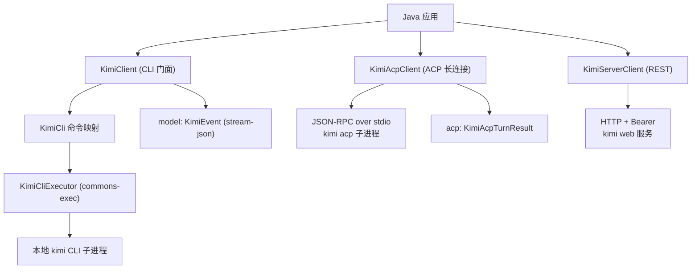

# kimi-java-sdk

[English](./README.md) | [简体中文](./README.zh-CN.md)

[](https://github.com/easy-4-java/kimi-java-sdk) [](https://www.apache.org/licenses/LICENSE-2.0.txt)

> Java SDK for the [Kimi Code CLI](https://www.kimi.com/code/docs): three
> integration routes — a subprocess wrapper for the `kimi` CLI, an ACP client
> (JSON-RPC over stdio) for IDE-style long-lived sessions, and a REST client
> for the `kimi web` server API.

## Table of Contents

- [1. Project Overview](#1-project-overview)
- [2. Features & Status](#2-features--status)
- [3. Requirements & Compatibility](#3-requirements--compatibility)
- [4. Architecture & Modules](#4-architecture--modules)
- [5. Installation](#5-installation)
- [6. Quick Start](#6-quick-start)
- [7. Configuration](#7-configuration)
- [8. Core Usage / API](#8-core-usage--api)
- [9. Testing & Build](#9-testing--build)
- [10. Versioning & Branches](#10-versioning--branches)
- [11. Contributing & License](#11-contributing--license)

## 1. Project Overview

`kimi-java-sdk` lets Java applications integrate the
[Kimi Code CLI](https://www.kimi.com/code/docs) agent (`kimi`) through three
routes. It is a **CLI wrapper + protocol client**, not a direct Moonshot AI
API client.

- **CLI route (local subprocess)** — every call maps to a real `kimi` command
  line invocation.
- **ACP route (long connection)** — spawns `kimi acp` and drives it over
  JSON-RPC on stdio: initialize → session lifecycle → prompt turns with
  streaming updates. Works on every supported JDK (no sockets).
- **Server route** — starts or attaches to `kimi web` and calls its REST API
  (envelope `{code, msg, data}`) with bearer-token auth.

The SDK covers:

- **Non-interactive prompts** — `kimi --prompt <p>` with text or
  `stream-json` output, model pin, session resume, continue-last, add-dirs,
  skills-dirs, agent/agent-file.
- **Session lifecycle** — interactive start, `--session` resume,
  `--continue`.
- **Utilities** — `login` (device-code OAuth), `doctor` (config/tui),
  `export`, `migrate`, `upgrade`, `vis`, `web` / `rotate-token`, the full
  `provider` subcommand family, plus a raw `execute` escape hatch.
- **ACP sessions** — initialize/authenticate/logout, session
  new/load/resume/list/fork/close/delete, prompt turns with
  `agent_message_chunk` deltas, cancel, set-model/set-mode.
- **Server core** — start/attach, healthz/meta/shutdown, sessions,
  prompts, messages, abort, plus generic get/post/delete.

What it is **not**:

- Not a Moonshot AI HTTP API client.
- Not a replacement for the `kimi` binary — the CLI must be installed and
  runnable.
- A TUI host: interactive runs capture child streams, so full terminal UI
  rendering is not available through the SDK.

Typical scenarios:

| Scenario | What you use |
| :--- | :--- |
| One-shot task | `KimiClient.prompt(prompt)` |
| Machine-readable event stream | `promptAndParse(prompt)` → `List<KimiEvent>` |
| IDE-style long session with deltas | `KimiAcpClient.prompt(sessionId, text, onDelta)` |
| Headless automation over REST | `KimiServerClient.postPrompt(sessionId, text)` |
| Environment diagnostics | `doctor()` / `KimiServerClient.meta()` |

## 2. Features & Status

| Capability | Status | Notes |
| :--- | :--- | :--- |
| CLI non-interactive prompts | Active development | `prompt`, `prompt(model)`, `promptJson`, `promptWithSession`, `promptContinueLast` |
| CLI sessions & flags | Active development | `--model`, `--session`, `--continue`, `--plan`, `--add-dir`, `--skills-dir`, `--agent`, `--agent-file` |
| stream-json parsing | Active development | `promptAndParse` → `List<KimiEvent>` |
| Auth / diagnostics / lifecycle | Active development | `login`, `doctor(config|tui)`, `export`, `migrate`, `upgrade`, `vis` |
| Web server passthrough | Active development | `web(args)`, `webRotateToken` |
| Provider management | Active development | `providerAdd`, `providerRemove`, `providerList(Json)`, `providerCatalogList/Add` |
| ACP long-connection route | Active development | `initialize`, session new/load/resume/list/fork/close/delete, prompt deltas, cancel, set-model/mode |
| Server REST route (core) | Active development | start/attach, healthz/meta/shutdown, sessions/prompts/messages/abort, envelope unwrap |
| Server WebSocket events | Not yet | subscribe `/api/v1/ws` with your own WS stack using the same bearer token |

> **Assumption**: capability statuses reflect the current state of the active
> branch; the module is under active development. API surface tracks the
> documented kimi CLI behaviour (command reference, ACP reference, server API).

## 3. Requirements & Compatibility

| Requirement | Version / Notes |
| :--- | :--- |
| JDK | 21+ (this branch) |
| Maven | wrapper included (`./mvnw`, Maven 4) |
| Kimi Code CLI | must be installed and on PATH (`localExecutable` configures the path) |

Version lines:

| Branch | JDK | Version |
| :--- | :--- | :--- |
| `feature/1.0.x` | 8 | `1.0.x.*` |
| `feature/2.0.x` | 17 | `2.0.x.*` |
| `feature/3.0.x` | 21 | `3.0.x.*` |

> All three lines ship the same three routes — the ACP route uses plain
> process pipes, so unlike WebSocket-based SDKs it is not restricted to
> newer JDKs.

## 4. Architecture & Modules



Single-module Maven project (`packaging: jar`).

| Package | Contents |
| :--- | :--- |
| `io.github.easy4j.kimi` | `KimiClient`, `KimiClientConfig`, `KimiException` |
| `io.github.easy4j.kimi.cli` | `KimiCli`, `KimiCliExecutor`, `KimiCliResult` |
| `io.github.easy4j.kimi.model` | `KimiEvent` (stream-json events) |
| `io.github.easy4j.kimi.acp` | `KimiAcpClient`, `KimiAcpConfig`, `KimiAcpTurnResult` |
| `io.github.easy4j.kimi.server` | `KimiServerClient`, `KimiServerConfig` |

## 5. Installation

Snapshots are distributed through the Aliyun Maven repository; releases also
land on GitHub Releases.

```xml
<dependency>
    <groupId>io.github.easy4j</groupId>
    <artifactId>kimi-java-sdk</artifactId>
    <version>3.0.x.20260630-SNAPSHOT</version>
</dependency>
```

## 6. Quick Start

```java
import io.github.easy4j.kimi.KimiClient;
import io.github.easy4j.kimi.KimiClientConfig;
import io.github.easy4j.kimi.cli.KimiCliResult;

public class KimiDemo {

    public static void main(String[] args) {
        KimiClientConfig config = new KimiClientConfig();
        config.setLocalExecutable("kimi");   // or an absolute path
        config.setDefaultModel("kimi-k2-turbo-preview");

        try (KimiClient client = new KimiClient(config)) {
            KimiCliResult result = client.prompt("用一句话介绍你自己");
            System.out.println("exit=" + result.getExitCode());
            System.out.println(result.getStdout());
        }
    }
}
```

## 7. Configuration

### 7.1 `KimiClientConfig` (CLI route)

| Field | Type | Default | Description |
| :--- | :--- | :--- | :--- |
| `localExecutable` | String | `kimi` | CLI executable name or absolute path |
| `localTimeoutSeconds` | int | `600` | Command execution timeout (seconds) |
| `localProbeTimeoutSeconds` | int | `5` | Availability probe timeout (seconds) |
| `defaultModel` | String | - | Forwarded as `--model` when set |
| `autoApproval` | String | - | `yolo` (ask on demand) or `auto` (never ask); interactive runs only |
| `session` / `continueLast` | String / boolean | - | `--session <id>` / `--continue`; mutually exclusive |
| `planMode` | boolean | `false` | `--plan` for interactive runs |
| `addDirs` / `skillsDirs` | String[] | - | Repeatable `--add-dir` / `--skills-dir` |
| `agent` / `agentFile` | String | - | `--agent` / `--agent-file` |

### 7.2 `KimiAcpConfig` (ACP route)

| Field | Type | Default | Description |
| :--- | :--- | :--- | :--- |
| `localExecutable` | String | `kimi` | Executable spawned with the `acp` subcommand |
| `acpSubcommand` | String | `acp` | Set `null` when the executable is already a complete launch command |
| `acpArgs` | String[] | - | Extra arguments after the subcommand |
| `connectTimeoutMillis` | int | `10000` | Process startup + `initialize` handshake timeout |
| `readTimeoutMillis` | int | `600000` | Per-turn upper bound (`session/prompt` → response) |
| `maxFrameChars` | int | `1048576` | Frame hard cap; oversized frames tear the transport down (`<= 0` unbounded) |
| `maxContentChars` | int | `1048576` | Per-turn content cap; excess truncated with a warning (`<= 0` unbounded) |

### 7.3 `KimiServerConfig` (server route)

| Field | Type | Default | Description |
| :--- | :--- | :--- | :--- |
| `localExecutable` | String | `kimi` | Executable started by `start()` |
| `host` / `port` | String / int | `127.0.0.1` / `58627` | Bind address of a started server |
| `token` / `tokenPath` | String | - / `~/.kimi-code/server.token` | Bearer token (or where to read it) |
| `baseUrl` | String | - | Attach to an already-running server instead |
| `connectTimeoutMillis` / `readTimeoutMillis` | int | `5000` / `120000` | HTTP timeouts |
| `startupTimeoutMillis` | int | `30000` | Health wait for `start()` |

## 8. Core Usage / API

### 8.1 Non-interactive prompts with JSONL events

```java
try (KimiClient client = new KimiClient(config)) {
    List<KimiEvent> events = client.promptAndParse("修复失败的测试");
    events.forEach(event -> System.out.println(event.getType() + " -> " + event.getContent()));
}
```

### 8.2 ACP long-connection sessions

```java
import io.github.easy4j.kimi.acp.KimiAcpClient;
import io.github.easy4j.kimi.acp.KimiAcpConfig;
import io.github.easy4j.kimi.acp.KimiAcpTurnResult;

KimiAcpConfig acpConfig = new KimiAcpConfig();
acpConfig.setLocalExecutable("kimi");
try (KimiAcpClient acp = new KimiAcpClient(acpConfig)) {
    acp.connect();                                             // initialize handshake
    String sessionId = acp.newSession("/path/to/project");     // session/new
    KimiAcpTurnResult turn = acp.prompt(sessionId, "梳理模块结构",
            delta -> System.out.print(delta));                 // agent_message_chunk 流
    System.out.println("\nstop=" + turn.getStopReason());
    acp.cancel(sessionId);                                     // 中断进行中的 turn
}
```

### 8.3 Server REST route

```java
import io.github.easy4j.kimi.server.KimiServerClient;
import io.github.easy4j.kimi.server.KimiServerConfig;

KimiServerConfig serverConfig = new KimiServerConfig();
try (KimiServerClient server = new KimiServerClient(serverConfig)) {
    server.start();                                        // spawns `kimi web`, waits healthz, reads token
    server.meta();
    JsonNode session = server.createSession("/path/to/project");
    String sessionId = session.path("session_id").asText();
    server.postPrompt(sessionId, "总结这个模块");
    server.messages(sessionId);
}
```

## 9. Testing & Build

```bash
./mvnw clean verify
```

- JaCoCo report + 90% line-coverage `check` goal bound to `verify`
  (`haltOnFailure=false`).
- The ACP route is covered by end-to-end tests against a fake ACP agent
  process (python3) speaking the same NDJSON JSON-RPC wire format; the
  server route against an in-process HTTP fake.

## 10. Versioning & Branches

| Branch | JDK | Version | Notes |
| :--- | :--- | :--- | :--- |
| `feature/1.0.x` | 8 | `1.0.x.*` | Default branch, JDK 8 baseline |
| `feature/2.0.x` | 17 | `2.0.x.*` | JDK 17 line |
| `feature/3.0.x` | 21 | `3.0.x.*` | JDK 21 line |

Maintenance policy: the three branches keep source, tests and READMEs in
sync; only `pom.xml` differs (JDK + Jackson/JUnit lines). Releases go to the
Aliyun Maven repository and GitHub Releases.

## 11. Contributing & License

Contributions are welcome — please open issues or pull requests on GitHub.

Licensed under the [Apache License, Version 2.0](https://www.apache.org/licenses/LICENSE-2.0.txt).
