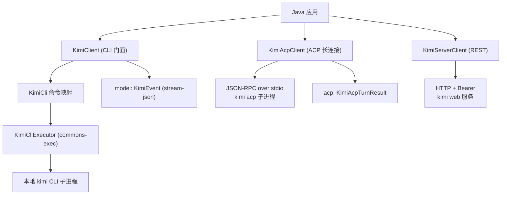

# kimi-java-sdk

[English](./README.md) | [简体中文](./README.zh-CN.md)

[](https://github.com/easy-4-java/kimi-java-sdk) [](https://www.apache.org/licenses/LICENSE-2.0.txt)

> [Kimi Code CLI](https://www.kimi.com/code/docs) 的 Java SDK：三条集成路线——
> `kimi` CLI 子进程封装、ACP 长连接客户端（stdio 上的 JSON-RPC）、`kimi web`
> 服务端 REST 客户端。

## 目录

- [1. 项目概述](#1-项目概述)
- [2. 功能与状态](#2-功能与状态)
- [3. 环境要求与兼容性](#3-环境要求与兼容性)
- [4. 架构与模块](#4-架构与模块)
- [5. 安装](#5-安装)
- [6. 快速开始](#6-快速开始)
- [7. 配置](#7-配置)
- [8. 核心用法 / API](#8-核心用法--api)
- [9. 测试与构建](#9-测试与构建)
- [10. 版本与分支](#10-版本与分支)
- [11. 贡献与许可](#11-贡献与许可)

## 1. 项目概述

`kimi-java-sdk` 让 Java 应用通过三条路线集成 [Kimi Code CLI](https://www.kimi.com/code/docs)
智能体（`kimi`）。它是 **CLI 封装 + 协议客户端**，不是直连 Moonshot AI API 客户端。

- **CLI 路线（本地子进程）**——每次调用都对应一次真实的 `kimi` 命令行执行。
- **ACP 路线（长连接）**——拉起 `kimi acp`，在 stdio 上以 JSON-RPC 驱动：
  initialize → 会话生命周期 → 流式 prompt turn。纯进程管道实现，不受 JDK
  版本限制。
- **Server 路线**——启动或接入 `kimi web`，以 Bearer token 调用其 REST API
  （统一信封 `{code, msg, data}`）。

SDK 覆盖：

- **非交互 prompt**——`kimi --prompt <p>`，支持 text / `stream-json` 输出、
  模型指定、会话恢复、continue-last、add-dirs、skills-dirs、agent/agent-file。
- **会话生命周期**——交互式启动、`--session` 恢复、`--continue`。
- **工具类**——`login`（设备码 OAuth）、`doctor`（config/tui）、`export`、
  `migrate`、`upgrade`、`vis`、`web` / `rotate-token`、`provider` 子命令族，
  以及原始 `execute` 逃生口。
- **ACP 会话**——initialize/authenticate/logout，session
  new/load/resume/list/fork/close/delete，prompt 流式 delta、cancel、
  set-model/set-mode。
- **Server 核心**——start/attach、healthz/meta/shutdown、sessions、
  prompts、messages、abort，及通用 get/post/delete。

它不是：

- Moonshot AI HTTP API 客户端。
- `kimi` 二进制的替代品——必须安装并可运行 CLI。
- TUI 宿主：交互式运行会捕获子进程流，完整终端 UI 渲染不可用。

典型场景：

| 场景 | 使用内容 |
| :--- | :--- |
| 一次性任务 | `KimiClient.prompt(prompt)` |
| 机器可读事件流 | `promptAndParse(prompt)` → `List<KimiEvent>` |
| IDE 式长会话 + 流式 | `KimiAcpClient.prompt(sessionId, text, onDelta)` |
| 无头自动化（REST） | `KimiServerClient.postPrompt(sessionId, text)` |
| 环境诊断 | `doctor()` / `KimiServerClient.meta()` |

## 2. 功能与状态

| 能力 | 状态 | 说明 |
| :--- | :--- | :--- |
| CLI 非交互 prompt | 活跃开发 | `prompt`、`prompt(model)`、`promptJson`、`promptWithSession`、`promptContinueLast` |
| CLI 会话与旗标 | 活跃开发 | `--model`、`--session`、`--continue`、`--plan`、`--add-dir`、`--skills-dir`、`--agent`、`--agent-file` |
| stream-json 解析 | 活跃开发 | `promptAndParse` → `List<KimiEvent>` |
| 认证 / 诊断 / 生命周期 | 活跃开发 | `login`、`doctor(config|tui)`、`export`、`migrate`、`upgrade`、`vis` |
| Web 服务透传 | 活跃开发 | `web(args)`、`webRotateToken` |
| Provider 管理 | 活跃开发 | `providerAdd`、`providerRemove`、`providerList(Json)`、`providerCatalogList/Add` |
| ACP 长连接路线 | 活跃开发 | `initialize`、session new/load/resume/list/fork/close/delete、prompt delta、cancel、set-model/mode |
| Server REST 路线（核心） | 活跃开发 | start/attach、healthz/meta/shutdown、sessions/prompts/messages/abort、信封解包 |
| Server WebSocket 事件 | 尚未提供 | 用自有 WS 栈以同一 Bearer token 订阅 `/api/v1/ws` |

> **假设**：能力状态反映当前活跃分支的情况；模块处于活跃开发中。API 面
> 跟随 kimi CLI 文档（命令参考、ACP 参考、server API）。

## 3. 环境要求与兼容性

| 要求 | 版本 / 说明 |
| :--- | :--- |
| JDK | 21+（本分支） |
| Maven | 项目自带 wrapper（`./mvnw`，Maven 4） |
| Kimi Code CLI | 必须安装且在 PATH 上（`localExecutable` 可配置路径） |

版本线：

| 分支 | JDK | 版本 |
| :--- | :--- | :--- |
| `feature/1.0.x` | 8 | `1.0.x.*` |
| `feature/2.0.x` | 17 | `2.0.x.*` |
| `feature/3.0.x` | 21 | `3.0.x.*` |

> 三条版本线提供相同的三条路线——ACP 路线基于进程管道，不像 WebSocket
> 类 SDK 那样受新 JDK 限制。

## 4. 架构与模块



单模块 Maven 工程（`packaging: jar`）。

| 包 | 内容 |
| :--- | :--- |
| `io.github.easy4j.kimi` | `KimiClient`、`KimiClientConfig`、`KimiException` |
| `io.github.easy4j.kimi.cli` | `KimiCli`、`KimiCliExecutor`、`KimiCliResult` |
| `io.github.easy4j.kimi.model` | `KimiEvent`（stream-json 事件） |
| `io.github.easy4j.kimi.acp` | `KimiAcpClient`、`KimiAcpConfig`、`KimiAcpTurnResult` |
| `io.github.easy4j.kimi.server` | `KimiServerClient`、`KimiServerConfig` |

## 5. 安装

快照通过阿里云 Maven 仓库分发；正式版同时发布 GitHub Releases。

```xml
<dependency>
    <groupId>io.github.easy4j</groupId>
    <artifactId>kimi-java-sdk</artifactId>
    <version>3.0.x.20260630-SNAPSHOT</version>
</dependency>
```

## 6. 快速开始

```java
import io.github.easy4j.kimi.KimiClient;
import io.github.easy4j.kimi.KimiClientConfig;
import io.github.easy4j.kimi.cli.KimiCliResult;

public class KimiDemo {

    public static void main(String[] args) {
        KimiClientConfig config = new KimiClientConfig();
        config.setLocalExecutable("kimi");   // 或绝对路径
        config.setDefaultModel("kimi-k2-turbo-preview");

        try (KimiClient client = new KimiClient(config)) {
            KimiCliResult result = client.prompt("用一句话介绍你自己");
            System.out.println("exit=" + result.getExitCode());
            System.out.println(result.getStdout());
        }
    }
}
```

## 7. 配置

### 7.1 `KimiClientConfig`（CLI 路线）

| 字段 | 类型 | 默认值 | 说明 |
| :--- | :--- | :--- | :--- |
| `localExecutable` | String | `kimi` | CLI 可执行文件名或绝对路径 |
| `localTimeoutSeconds` | int | `600` | 命令执行超时（秒） |
| `localProbeTimeoutSeconds` | int | `5` | 可用性探测超时（秒） |
| `defaultModel` | String | - | 设置时转发 `--model` |
| `autoApproval` | String | - | `yolo`（按需询问）或 `auto`（从不询问）；仅交互运行 |
| `session` / `continueLast` | String / boolean | - | `--session <id>` / `--continue`；互斥 |
| `planMode` | boolean | `false` | 交互运行的 `--plan` |
| `addDirs` / `skillsDirs` | String[] | - | 可重复的 `--add-dir` / `--skills-dir` |
| `agent` / `agentFile` | String | - | `--agent` / `--agent-file` |

### 7.2 `KimiAcpConfig`（ACP 路线）

| 字段 | 类型 | 默认值 | 说明 |
| :--- | :--- | :--- | :--- |
| `localExecutable` | String | `kimi` | 以 `acp` 子命令拉起的可执行文件 |
| `acpSubcommand` | String | `acp` | executable 已是完整启动命令时置 `null` |
| `acpArgs` | String[] | - | 子命令后的额外参数 |
| `connectTimeoutMillis` | int | `10000` | 进程启动 + `initialize` 握手超时 |
| `readTimeoutMillis` | int | `600000` | 单 turn 上限（`session/prompt` → 响应） |
| `maxFrameChars` | int | `1048576` | 帧硬上限；超限帧摧毁传输（`<= 0` 不限） |
| `maxContentChars` | int | `1048576` | 单 turn 内容上限；超出截断并告警（`<= 0` 不限） |

### 7.3 `KimiServerConfig`（Server 路线）

| 字段 | 类型 | 默认值 | 说明 |
| :--- | :--- | :--- | :--- |
| `localExecutable` | String | `kimi` | `start()` 拉起的可执行文件 |
| `host` / `port` | String / int | `127.0.0.1` / `58627` | 所启服务的绑定地址 |
| `token` / `tokenPath` | String | - / `~/.kimi-code/server.token` | Bearer token（或读取位置） |
| `baseUrl` | String | - | 直接接入已运行的服务 |
| `connectTimeoutMillis` / `readTimeoutMillis` | int | `5000` / `120000` | HTTP 超时 |
| `startupTimeoutMillis` | int | `30000` | `start()` 健康等待 |

## 8. 核心用法 / API

### 8.1 非交互 prompt 与 JSONL 事件

```java
try (KimiClient client = new KimiClient(config)) {
    List<KimiEvent> events = client.promptAndParse("修复失败的测试");
    events.forEach(event -> System.out.println(event.getType() + " -> " + event.getContent()));
}
```

### 8.2 ACP 长连接会话

```java
import io.github.easy4j.kimi.acp.KimiAcpClient;
import io.github.easy4j.kimi.acp.KimiAcpConfig;
import io.github.easy4j.kimi.acp.KimiAcpTurnResult;

KimiAcpConfig acpConfig = new KimiAcpConfig();
acpConfig.setLocalExecutable("kimi");
try (KimiAcpClient acp = new KimiAcpClient(acpConfig)) {
    acp.connect();                                             // initialize 握手
    String sessionId = acp.newSession("/path/to/project");     // session/new
    KimiAcpTurnResult turn = acp.prompt(sessionId, "梳理模块结构",
            delta -> System.out.print(delta));                 // agent_message_chunk 流
    System.out.println("\nstop=" + turn.getStopReason());
    acp.cancel(sessionId);                                     // 中断进行中的 turn
}
```

### 8.3 Server REST 路线

```java
import io.github.easy4j.kimi.server.KimiServerClient;
import io.github.easy4j.kimi.server.KimiServerConfig;

KimiServerConfig serverConfig = new KimiServerConfig();
try (KimiServerClient server = new KimiServerClient(serverConfig)) {
    server.start();                                        // 拉起 `kimi web`、等 healthz、读 token
    server.meta();
    JsonNode session = server.createSession("/path/to/project");
    String sessionId = session.path("session_id").asText();
    server.postPrompt(sessionId, "总结这个模块");
    server.messages(sessionId);
}
```

## 9. 测试与构建

```bash
./mvnw clean verify
```

- JaCoCo 报告 + 90% 行覆盖 `check` 目标绑定在 `verify` 阶段
  （`haltOnFailure=false`）。
- ACP 路线由对假 ACP agent 进程（python3，同线缆格式 NDJSON JSON-RPC）的
  端到端测试覆盖；Server 路线由进程内 HTTP 假服务器覆盖。

## 10. 版本与分支

| 分支 | JDK | 版本 | 说明 |
| :--- | :--- | :--- | :--- |
| `feature/1.0.x` | 8 | `1.0.x.*` | 默认分支，JDK 8 基线 |
| `feature/2.0.x` | 17 | `2.0.x.*` | JDK 17 版本线 |
| `feature/3.0.x` | 21 | `3.0.x.*` | JDK 21 版本线 |

维护策略：三分支保持源码、测试与 README 同步；仅 `pom.xml` 存在差异
（JDK + Jackson/JUnit 线）。发布走阿里云 Maven 仓库与 GitHub Releases。

## 11. 贡献与许可

欢迎通过 GitHub Issue 或 Pull Request 参与贡献。

本项目基于 [Apache License, Version 2.0](https://www.apache.org/licenses/LICENSE-2.0.txt) 许可。
